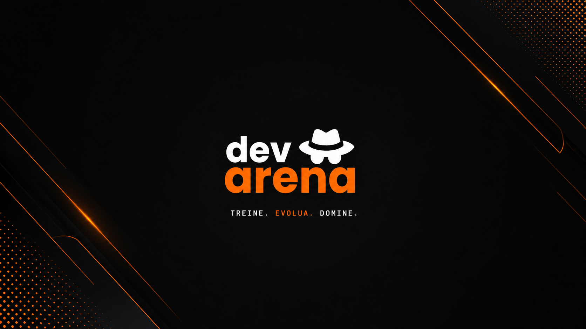

<p align="center">
  
</p>

<h1 align="center">DevArena</h1>

<p align="center">
  Plataforma web interativa voltada para treino de digitação, análise de desempenho e evolução do usuário em tempo real.
</p>

<p align="center">
  Projeto individual desenvolvido para disciplinas da SPTech.
</p>

---

## Sobre o Projeto

O **DevArena** foi desenvolvido com o objetivo de unir experiência interativa, performance e análise de dados em uma plataforma moderna de treino de digitação.

A aplicação permite que usuários acompanhem sua evolução através de métricas em tempo real, rankings e dashboards analíticas, proporcionando uma experiência dinâmica e competitiva.

---

## Funcionalidades

- Sistema de login e cadastro
- Arena de digitação interativa
- Contador de WPM em tempo real
- Sistema de precisão de palavras
- Dashboard com gráficos e métricas
- Ranking de usuários
- Histórico de desempenho
- Interface responsiva e moderna

---

## Tecnologias Utilizadas

<div align="center">

| Front-End | Back-End | Banco de Dados | Bibliotecas |
|------------|------------|----------------|--------------|
| HTML5 | Node.js | MySQL | Chart.js |
| CSS3 | Express | SQL | Web Data Viz |
| JavaScript | JavaScript |  |  |

</div>

---

## Estrutura do Projeto

```bash
DevArena/
│
├── public/
│   ├── assets/
│   ├── css/
│   ├── js/
│   └── pages/
│
├── src/
├── database/
├── app.js
├── package.json
└── README.md
```

---

## Dashboard e Métricas

A plataforma possui dashboards desenvolvidas para análise de desempenho do usuário, permitindo visualização de métricas como:

- Evolução de WPM
- Precisão média
- Histórico de partidas
- Estatísticas gerais
- Comparativo de desempenho

---

## Objetivo

O projeto tem como foco aplicar conceitos de:

- desenvolvimento web
- experiência do usuário
- análise de dados
- interatividade
- gamificação

através de uma aplicação moderna e funcional.

---

<div align="center">

### Henrique Nakanishi

Estudante de Ciência da Computação — SPTech

</div>